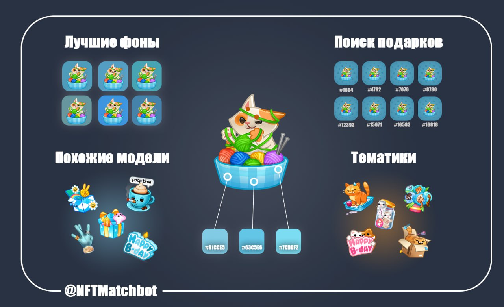
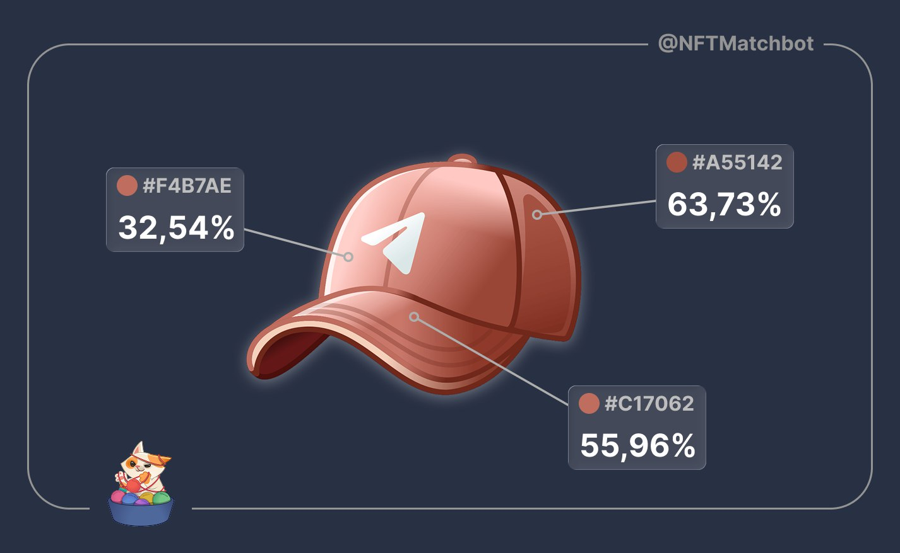

# 🎨 NFT Match - Telegram Gifts & NFTs Matcher

[English](#english) | [Русский](#русский)

---

## English

**NFT Match** is a specialized analytical service designed for Telegram NFT Gift collectors. It helps users discover the most aesthetically harmonious combinations of gift models (2D Lottie animations) and backgrounds, search for visually similar items, and browse thematic collections.

### ⚙️ How works NFTMatch?

**@NFTMatchbot evaluates the monochrome compatibility of a gift in three stages:**
1. determines the key color,
2. analyzes three of its shades and coverage percentage,
3. calculates compatibility using the DeltaE 2000 formula, which accounts for human perception.

A web application is available for manual correction.

#### Detailed step-by-step calculation:

1. **Finding the Key Color**
   First, the algorithm analyzes the model (2D Lottie animation) and extracts one key color.
   *Important:* this is not necessarily the most dominant color. It is the color that is logically central to the gift's composition.
   For some complex models, the bot might make a mistake. We have anticipated this: open our Web App — there is a tool where you can manually specify the desired model color.

2. **Analyzing Shades and Weight**
   After determining the base, the algorithm saves 3 shades of this color. This is necessary for variety, to account for light, shadows, and highlights.
   For each of these shades, the percentage of coverage (weight) is calculated. If the color occupies 80% of the model, it will have the maximum impact on the final score.

3. **Calculating Compatibility**
   The compatibility percentage is calculated using the **DeltaE 2000** formula.
   The formula evaluates the difference between colors as close as possible to human perception. It considers not just digital RGB values, but how the eye sees saturation, brightness, and hue.
   
   *Note:* Sometimes you might see a score you disagree with. This is usually due to two reasons: incorrectly selected colors or algorithmic nuances.
   
   If you have suggestions for improving the algorithm or ideas for cooperation, write to the owner: **@Criminal_hamster**
   
   *Thank you for using NFTMatch!*

### 📂 Website Structure & Routing
- **Home Page:** `/index.html` — Entry point, active carousel, and features grid.
- **Monochromes:** `/Monohrome/background-finder.html` — Tool for matching model colors with backgrounds.
- **Similar:** `/nft-page/index.html` — Algorithmic search for visually similar gifts across collections.
- **Thematics:** `/Thematic/themes.html` — Catalog of items grouped into semantic categories with floor prices.
- **API Credentials:** `/API_info/api.html` — API key generation hub for developers.
- **Support:** `/Support/support.html` — Support the project development.

---

## Русский

**NFT Match** — аналитический сервис в сфере Telegram NFT-подарков, созданный для коллекционеров. Он позволяет подбирать наилучшие сочетания 2D Lottie-анимации модели подарка и его заднего фона, искать визуально похожие модели и изучать тематические подборки.

### ⚙️ Как работает NFTMatch?

**@NFTMatchbot оценивает монохромность подарка в три этапа:**
1. определяет ключевой цвет,
2. анализирует три его оттенка и процент покрытия,
3. рассчитывает совместимость по формуле DeltaE 2000, учитывающей восприятие человека.

Для корректировки доступно веб-приложение.

#### Подробный расчет, шаг за шагом:

1. **Поиск ключевого цвета**
   Сначала алгоритм анализирует модель (2D Lottie-анимацию) и выделяет один ключевой цвет.
   *Важно:* это не обязательно тот цвет, которого больше всего. Это цвет, который является логически главным в композиции подарка.
   На некоторых сложных моделях бот может ошибиться. Мы предусмотрели это: зайдите в наше Web App — там есть инструмент, с помощью которого вы можете вручную указать нужный вам цвет модели.

2. **Анализ оттенков и веса**
   После определения основы алгоритм сохраняет 3 оттенка этого цвета. Это нужно для разнообразия, чтобы учитывать свет, тень и блики.
   Для каждого из этих оттенков рассчитывается процент покрытия (вес). Если цвет занимает 80% модели, он будет максимально влиять на итоговую оценку.

3. **Расчет совместимости**
   Процент совместимости высчитывается по формуле **DeltaE 2000**.
   Формула оценивает разницу между цветами максимально близко к человеческому восприятию. Она учитывает не просто цифровые значения RGB, а то, как глаз видит насыщенность, яркость и тон.
   
   *Примечание:* Иногда вы можете увидеть оценку, с которой не согласны. Чаще всего это связано с двумя причинами: неправильно выбранные цвета или нюансы алгоритма.
   
   Если у вас есть предложения по улучшению алгоритма или идеи для сотрудничества, напишите владельцу: **@Criminal_hamster**
   
   *Спасибо, что используете NFTMatch!*

### 📂 Структура сайта и пути (Routing)
- **Главная страница:** `/index.html` — Входная точка, карусель продаж и меню функций.
- **Монохромы:** `/Monohrome/background-finder.html` — Инструмент для автоматического сопоставления модели и фона.
- **Похожие:** `/nft-page/index.html` — Поиск визуально и геометрически похожих подарков по всем коллекциям.
- **Тематики:** `/Thematic/themes.html` — Каталог подарков, сгруппированных по смысловым категориям, с ценами Floor Price.
- **Личный кабинет API:** `/API_info/api.html` — Панель выпуска ключей для разработчиков.
- **Поддержка:** `/Support/support.html` — Страница помощи развитию проекта.

---

### 🌐 Ссылки / Links
- **Основной сайт:** [nftmatch.pro](https://nftmatch.pro)
- **Демонстрационный сайт:** [maximymmax.github.io/NFTMatch-Service/](https://maximymmax.github.io/NFTMatch-Service/)
- **Документация API (Swagger UI):** [nftmatch.pro/api/swagger/ui](https://nftmatch.pro/api/swagger/ui)
- **Личный кабинет API:** [https://nftmatch.pro/API_info/api.html](https://nftmatch.pro/API_info/api.html)
- **Телеграм-бот:** [@NFTMatchBot](https://t.me/NFTMatchBot)
- **Телеграм-канал:** [@NFTStyler](https://t.me/NFTStyler)
