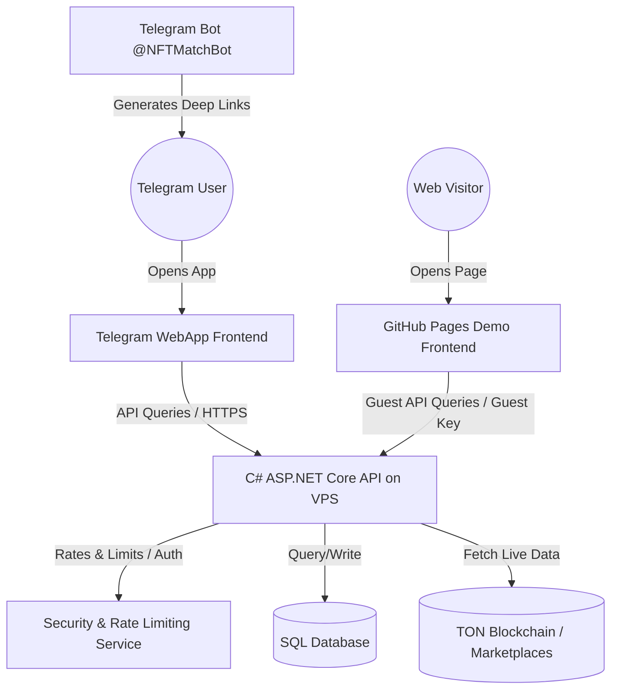
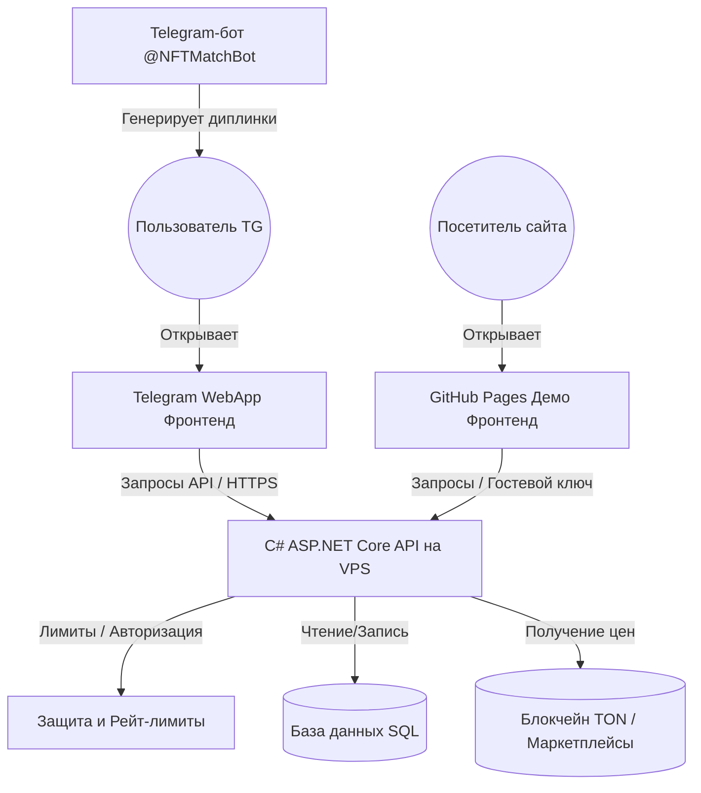

# 🎨 NFTMatch - Telegram Gifts & NFTs Analytics Suite

[English](#english) | [Русский](#русский)

---

<a name="english"></a>
## English

**NFTMatch** is a premium analytical search and matching platform designed specifically for **Telegram Gifts and NFTs**. The project helps users explore, match, and evaluate the rarity and aesthetic quality of NFT collections on the TON blockchain.

### 🌐 Quick Links
- **Live Production App:** [nftmatch.pro](https://nftmatch.pro) (for Telegram WebApp)
- **Live Demo Site:** [maximymmax.github.io/NFTMatch-Service/](https://maximymmax.github.io/NFTMatch-Service/) (requires no Telegram login)
- **API Swagger Documentation:** [nftmatch.pro/api/swagger/ui](https://nftmatch.pro/api/swagger/ui)
- **Telegram Bot:** [@NFTMatchBot](https://t.me/NFTMatchBot)
- **Telegram Channel:** [@NFTStyler](https://t.me/NFTStyler)

---

### 💡 Core Project Idea
With the release of Telegram Gifts and their conversion into NFTs on the TON blockchain, collectors faced a challenge: how to identify visually appealing combinations, track floor prices of specific patterns, and find thematic matches. 

**NFTMatch** solves this by providing:
1. **Color Harmony Search (Monochromes):** Identifying perfect matches where the model color matches the background gradient.
2. **Visual Similarity Analysis:** An algorithmic engine that scans and finds visually matching geometries and styles across collections.
3. **Semantic Clustering (Themes):** A curated tree and list catalog grouping gifts into categories (e.g., *Winter*, *Animals*, *Sci-Fi*, *Food*) with real-time price limits and availability indicators.
4. **Developer Open API:** A public REST API offering structured JSON data for other developers to build TON NFT tools.

---

### 🗺️ System Architecture

The following Mermaid diagram visualizes the NFTMatch ecosystem:



---

### 🚀 Key Features

* **🎨 Monochrome Matcher:** Find models that seamlessly match background colors (e.g. Amber, Celtic Blue, Mint Green). Shows combinations with matching percentage metrics.
* **🔍 Similarity Finder:** Input any gift and look up visually similar models across 100+ Telegram Gift collections.
* **📂 Thematic Groups:** Explore gifts organized in tree structure groups. Includes live floor prices from marketplaces, sorting by floor price or count, and color filtering.
* **🔑 API Management Hub:** An interactive portal where developers can generate API keys (Basic and Pro levels) to integrate NFTMatch analytics into their own tools.

---

### 🛠️ Frontend Tech Stack
- **Structure:** HTML5, Semantic DOM.
- **Styling:** Vanilla CSS3 (Custom Variables, Flexbox, Grid, Backdrop Filters, glowing animations).
- **Logic:** Native JavaScript (ES6+, asynchronous fetch requests, Session/LocalStorage cache).
- **Internationalization:** Custom lightweight localization module (`i18n.js`) supporting English and Russian.
- **Integration:** Telegram WebApp SDK, Lottie animations, Telegram Login API (OAuth 2.0 PKCE).

---

### 💻 Local Setup & Development

To test the frontend locally:
1. Clone the repository:
   ```bash
   git clone https://github.com/MaximymMax/NFTMatch-Service.git
   cd NFTMatch-Service
   ```
2. Open `index.html` in any web browser or use a local development server (like VS Code Live Server).
3. The app is preconfigured to connect to the production backend at `https://nftmatch.pro`.

---

<br/>

---

<a name="русский"></a>
## Русский

**NFTMatch** — это аналитическая платформа для поиска, подбора и оценки эстетической совместимости **Telegram-подарков (Gifts) и NFT** на блокчейне TON.

### 🌐 Быстрые ссылки
- **Основной сайт (внутри TG):** [nftmatch.pro](https://nftmatch.pro)
- **Демонстрационный сайт:** [maximymmax.github.io/NFTMatch-Service/](https://maximymmax.github.io/NFTMatch-Service/) (работает без авторизации через Telegram)
- **Документация API (Swagger UI):** [nftmatch.pro/api/swagger/ui](https://nftmatch.pro/api/swagger/ui)
- **Телеграм-бот:** [@NFTMatchBot](https://t.me/NFTMatchBot)
- **Телеграм-канал:** [@NFTStyler](https://t.me/NFTStyler)

---

### 💡 Идея проекта
После запуска Telegram-подарков и их перевода в формат NFT перед коллекционерами встала задача: как находить наиболее редкие, гармоничные сочетания цветов, отслеживать минимальные цены (Floor Price) и группировать подарки по смыслу.

**NFTMatch** решает эту проблему, предлагая:
1. **Поиск цветовой гармонии (Монохромы):** Алгоритм подбирает идеальные сочетания, где цвет модели совпадает с цветом фона.
2. **Анализ визуального сходства:** Алгоритм сравнивает геометрию и стиль подарков, находя похожие модели в более чем 100 коллекциях.
3. **Семантическая кластеризация (Тематики):** Каталог, разделенный на смысловые группы (например, *Зима*, *Животные*, *Праздники*, *Еда*) с отображением минимальных цен на маркетах в реальном времени.
4. **Открытый API для разработчиков:** Полноценный REST API, отдающий структурированные JSON-данные для интеграции в сторонние TON-сервисы.

---

### 🗺️ Архитектура системы

Интерактивная диаграмма взаимодействия компонентов NFTMatch:



---

### 🚀 Ключевые возможности

* **🎨 Подбор монохромов:** Поиск моделей, идеально сочетающихся по цвету с задними фонами подарков (Amber, Celtic Blue, Mint Green и др.).
* **🔍 Поиск похожих:** Алгоритмический подбор визуально схожих моделей среди сотен коллекций Telegram-подарков.
* **📂 Тематические категории:** Дерево тематик для группировки предметов. Поддерживает фильтрацию по цене в TON, цвету фона и проценту совпадения.
* **🔑 Управление API-ключами:** Панель генерации токенов (Базовый и Расширенный уровни) для разработчиков TON-приложений.

---

### 🛠️ Стек технологий фронтенда
- **Разметка:** HTML5, семантическая структура.
- **Стилизация:** Чистый CSS3 (переменные, Flexbox, Grid, стеклянный эффект `backdrop-filter`, анимация свечения).
- **Логика:** Чистый JavaScript (ES6+, асинхронные fetch-запросы, кэширование в Session/LocalStorage).
- **Локализация:** Легковесный модуль перевода (`i18n.js`) с полной поддержкой русского и английского языков.
- **Интеграция:** Telegram WebApp SDK, анимации Lottie, авторизация Telegram Login (OAuth 2.0 PKCE).

---

### 💻 Локальный запуск и разработка

Для запуска сайта на локальном компьютере:
1. Склонируйте репозиторий:
   ```bash
   git clone https://github.com/MaximymMax/NFTMatch-Service.git
   cd NFTMatch-Service
   ```
2. Откройте файл `index.html` в любом браузере или запустите локальный веб-сервер (например, плагин Live Server в VS Code).
3. Приложение автоматически подключится к рабочему API бэкенда на `https://nftmatch.pro`.
